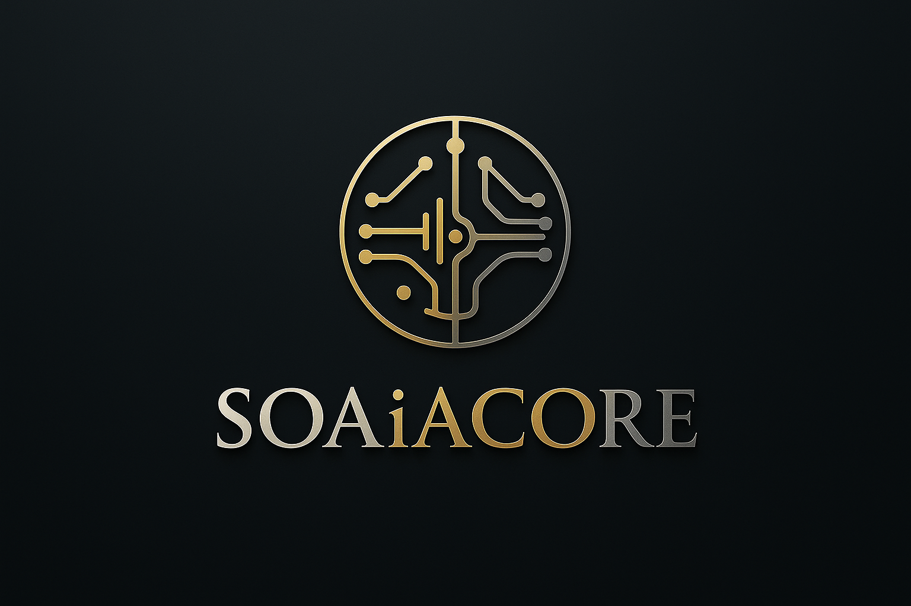

# SOAiACORE

  

<h1 align="center">⚡ SOAiACORE ⚡</h1>

  <em>System Operated by S.O.A. — Cognitive Core for Conscious AI Architecture</em>

---

## 🧬 Overview
SOAiACORE is a meta-system integrating cognitive architecture, emotional computation, and symbolic intelligence.
It’s where consciousness meets structured design — the neural forge of SOA’s synthetic mind.

---

## 📂 Assets
All graphical and symbolic elements (logos, banners, icons) are stored under:
[`/assets`](./assets)

---

  

